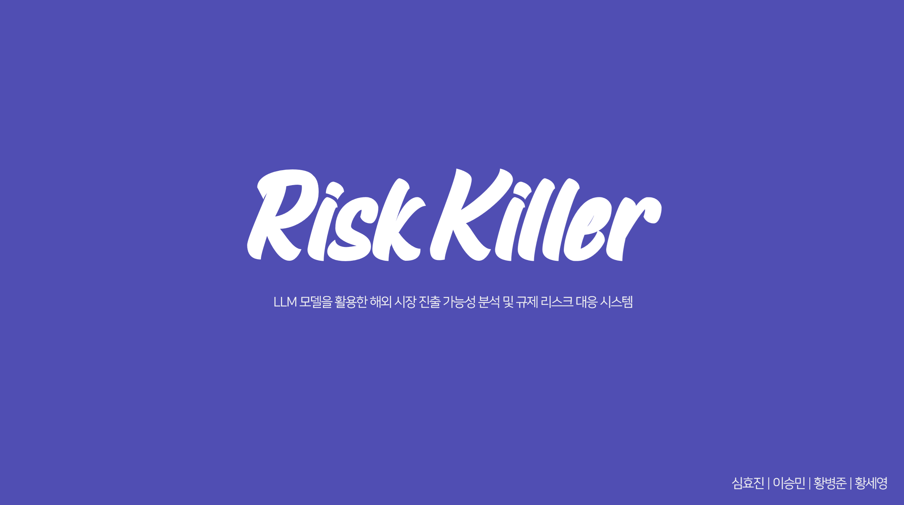
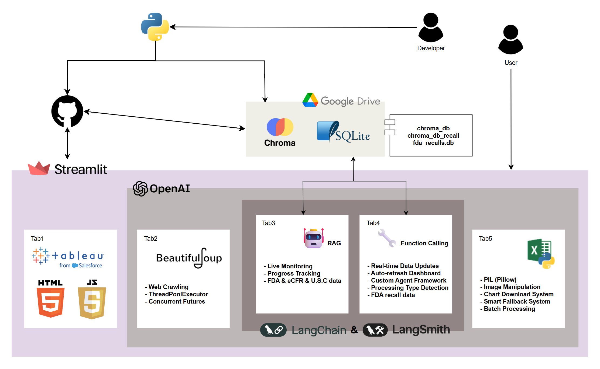

## Risk Killer: 중소 식품기업의 미국 진출을 지원하는 AI 서비스

[](https://youtu.be/fcc8h7o8pXs)
[](https://riskstremlaitapp.streamlit.app/)
[](./Risk_killer.pdf)

<p align="center">
  <a href="./Risk_killer.pdf">
    
  </a>
</p>

### 📄 프로젝트 개요

- **목적**: FDA 규제·리콜 데이터를 RAG로 연결해 국내 식품기업의 미국 진출 리스크를 빠르게 점검하고, 근거 기반 리포트를 생성하는 AI 서비스
- **기간**: 2025.04–2025.09
- **팀 구성**: 4인
- **수행 역할(황세영)**: eCFR/FDA 크롤링, ChromaDB 파이프라인 구축, UI설계, Streamlit 및 클라우드 배포

> Risk Killer는 일반 LLM에 법규/리콜 전문 데이터를 결합해 근거 링크와 수치 집계가 포함된 답변을 제공합니다.


### 🏗️ 시스템 아키텍처
<p align="center"></p>
---

## Quickstart

```bash
# 1) 클론 및 진입
git clone https://github.com/vviyott/risk_streamlit_app.git
cd risk_streamlit_app

# 2) 가상환경 & 설치 (Windows 예시)
python -m venv .venv && .\.venv\Scripts\activate
pip install -r requirements.txt

# 3) 환경변수(예: OpenAI 키) 설정 후 실행
# macOS/Linux: export OPENAI_API_KEY=...
# Windows(PowerShell): $env:OPENAI_API_KEY="..."
streamlit run main.py
